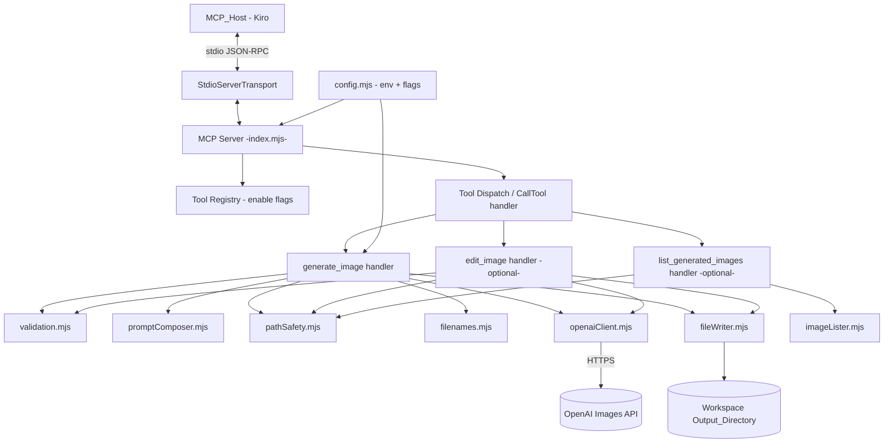
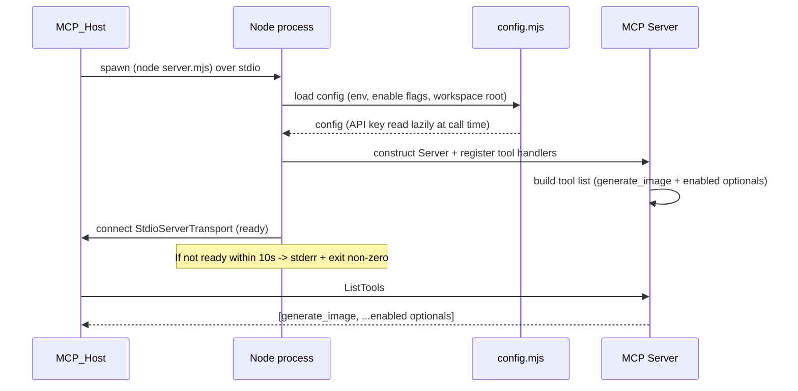

# Design Document

## Overview

The Image_Gen_MCP_Server is a local, stdio-based Model Context Protocol (MCP) server written in Node.js (ESM). It bridges a Kiro workspace to OpenAI's Images API so Kiro can generate images from within a conversation and have the resulting PNG written **directly into the workspace** — no ChatGPT copy/paste round trip.

The server exposes one required tool, `generate_image`, and two optional tools, `edit_image` and `list_generated_images`, whose registration is gated by enable flags. It reads its OpenAI credential from the `OPENAI_API_KEY` environment variable, never commits secrets, and is registered through `.kiro/settings/mcp.json`. An optional Style_Guide_File is prepended to every prompt so generated art stays on-brand.

The whole deliverable ships as the self-contained `day-05-image-gen-mcp` challenge folder (server code, README, `.kiro` example config, `.env.example`, `.gitignore`) matching the structure of prior challenge days.

### Key Design Goals

- **Native-feeling image generation** — Kiro composes the prompt, calls the tool, and immediately sees the saved file.
- **Safe by default** — all writes are confined to the workspace via canonical path resolution; secrets are read from the environment and never logged.
- **Resilient** — the server survives every error path and keeps serving subsequent tool calls without a restart.
- **Portable** — a single Node.js ESM package startable from inside the challenge folder.

### Research Notes

Key findings that inform the design, drawn from the MCP SDK and OpenAI Images API references:

- **MCP transport & SDK** — The `@modelcontextprotocol/sdk` package provides a `Server` class plus a `StdioServerTransport`. Tools are advertised by handling `ListToolsRequestSchema` and executed by handling `CallToolRequestSchema`. Tool inputs are described with JSON Schema. A tool "error" is conventionally returned as a normal result with `isError: true` and text content, rather than thrown, so the host can surface it to the model. ([MCP SDK](https://github.com/modelcontextprotocol/typescript-sdk), [MCP spec](https://modelcontextprotocol.io))
- **OpenAI Images API** — Generation is `POST /v1/images/generations` with `model`, `prompt`, `size`, `quality`, and `n`. `gpt-image-1` always returns base64 image data in `data[].b64_json`; `dall-e-3` returns a URL by default but supports `response_format: "b64_json"`. Edits use `POST /v1/images/edits` (multipart, with an image file and prompt). Model-access failures surface as HTTP 403/404-class errors; invalid keys as 401; rate limits as 429. ([OpenAI Images API](https://platform.openai.com/docs/api-reference/images)) *Content was rephrased for compliance with licensing restrictions.*
- **Size/quality sets differ per model** — `gpt-image-1` supports sizes like `1024x1024`, `1536x1024`, `1024x1536`, `auto` and qualities `low`/`medium`/`high`/`auto`; `dall-e-3` supports `1024x1024`, `1792x1024`, `1024x1792` and qualities `standard`/`hd`. The design normalizes a shared Supported_Size / Supported_Quality set at the tool boundary and maps to model-specific values when building each request.

## Architecture

The server is organized into a thin protocol layer over a set of pure, unit-testable core modules. Business logic (validation, prompt composition, path safety, filename derivation, listing) lives in pure functions; side effects (network, filesystem, environment, clock) are isolated at the edges and injected so the core can be tested deterministically.



### Startup sequence



The server marks itself **ready** only after tool handlers are registered and the transport is connected. A tool-list request received before the ready flag is set returns a "not ready" error rather than a partial list (Req 1.7). A startup watchdog enforces the 10-second budget: if registration/connection has not completed, the process writes a startup-failure message to `stderr` and exits non-zero (Req 1.4).

### Design decisions and rationale

- **Pure core + injected effects** — Keeps validation, path safety, prompt composition, and naming deterministic and property-testable, and keeps the OpenAI/filesystem boundaries thin. This directly enables the correctness properties below.
- **Errors as `isError` results, not thrown exceptions** — Requirement 8.7 requires the server to keep running after any error. Returning structured error Tool_Results (instead of crashing the handler) makes "server survives and serves the next call" the natural default.
- **Lazy API-key read at call time** — The key is validated when a network-calling tool is invoked (Req 2.2), not at startup, so the server can start and list tools even without a key, and so a key added after launch is picked up.
- **Model fallback in the client layer** — `gpt-image-1 -> dall-e-3` fallback (Req 4.5) is encapsulated so tool handlers stay declarative and the "used model" is reported back uniformly.

## Components and Interfaces

### `index.mjs` (entry / protocol layer)

Bootstraps configuration, constructs the MCP `Server`, registers the `ListTools` and `CallTool` handlers, connects the `StdioServerTransport`, and arms the startup watchdog. Owns the `ready` flag and the process exit behavior. Contains no business logic.

### `config.mjs`

Pure-ish configuration assembly from the environment (effects injected for tests):

```
loadConfig(env, cwd) -> {
  workspaceRoot: string,            // absolute
  defaultOutputDir: string,         // "public/images"
  styleGuidePath: string | null,    // optional
  enableEditTool: boolean,
  enableListTool: boolean,
  defaults: { size: Default_Size, quality: Default_Quality, model: "gpt-image-1" }
}
readApiKey(env) -> { ok: true, key } | { ok: false, reason: "missing" }
```

`readApiKey` treats absent, empty, and whitespace-only values as missing (Req 2.2).

### `validation.mjs` (pure)

Validates and normalizes tool inputs, returning a discriminated result rather than throwing:

```
validateGenerateInput(raw, config) ->
  { ok: true, value: NormalizedGenerateInput } |
  { ok: false, error: ValidationError }   // names the offending parameter
```

Checks, in order: `prompt` present and 1–4000 chars (Req 3.3, 5.1); `size` ∈ Supported_Size if provided (Req 3.4); `quality` ∈ Supported_Quality if provided (Req 3.5); `model` ∈ {`gpt-image-1`,`dall-e-3`} if provided (Req 4.4); `filename` well-formed (Req 6.4, 6.5). Applies Default_Size / Default_Quality / default model when omitted (Req 3.6, 3.7, 4.2). `validateEditInput` performs the analogous checks for the edit tool (Req 9.2, 9.5).

### `promptComposer.mjs` (pure + injected reader)

Builds the Effective_Prompt:

```
composePrompt(callerPrompt, styleGuideResult) -> {
  effectivePrompt: string,
  warning: string | null
}
```

`styleGuideResult` is produced by an injected `readStyleGuide(path, timeoutMs)` that returns one of: `{ status: "none" }`, `{ status: "ok", contents }`, `{ status: "unreadable" }`, `{ status: "too_long" }`, `{ status: "empty" }`. Composition rule: when status is `ok` and contents are 1–20000 chars, `effectivePrompt = contents + "\n\n" + callerPrompt` (Req 5.2); otherwise `effectivePrompt = callerPrompt` and an appropriate warning is set for `unreadable` (Req 5.4), `too_long` (Req 5.5), and `empty` (Req 5.6). `none` yields no warning (Req 5.3).

### `pathSafety.mjs` (pure over an injected `realpath`)

The security boundary for all filesystem writes:

```
resolveOutputDir(requestedDir, workspaceRoot, realpath) ->
  { ok: true, canonicalDir } | { ok: false, error: PathSafetyError }
resolveSavePath(canonicalDir, filename, workspaceRoot) ->
  { ok: true, canonicalPath } | { ok: false, error: PathSafetyError }
isWithinWorkspace(candidate, workspaceRoot) -> boolean
```

Directories and paths are canonicalized (symlinks and `.`/`..` resolved) before any write (Req 6.1). A resolved path is accepted only if it equals or is a descendant of Workspace_Root (Req 6.2, 6.3); `isWithinWorkspace` uses `path.relative` and rejects results that are empty-with-different-root, start with `..`, or are absolute. For directories that do not yet exist, resolution canonicalizes the nearest existing ancestor and appends the remaining segments so a not-yet-created Output_Directory can still be safety-checked.

### `filenames.mjs` (pure)

```
validateFilename(name) -> { ok: true } | { ok: false, error }   // Req 6.4, 6.5
deriveUniqueFilename(desiredName, existingNames, timestamp) -> string   // Req 3.12, 3.13
```

`validateFilename` rejects names containing `/`, `\`, or `..`, and names that are empty, whitespace-only, or > 255 chars. `deriveUniqueFilename` returns `desiredName` if it does not collide; otherwise it appends a numeric/timestamp suffix before the extension until the name is unique within `existingNames`. When no filename is supplied, a unique timestamped default (e.g. `image-<timestamp>-<n>.png`) is generated.

### `openaiClient.mjs` (effectful, injectable `fetch`)

Wraps the OpenAI Images API with a 60-second timeout and the model-fallback policy:

```
generate({ apiKey, model, effectivePrompt, size, quality, fetchImpl, now }) ->
  { ok: true, model: usedModel, b64: string } |
  { ok: false, kind: ErrorKind, message }
edit({ apiKey, model, sourceBytes, prompt, size, fetchImpl }) -> same shape
```

If a `gpt-image-1` request is rejected for lack of account access, the client retries **exactly once** with `dall-e-3` (Req 4.5); if that is also rejected for access, it returns a `model_access` error (Req 4.6, 8.2). `ErrorKind` ∈ {`auth`, `model_access`, `network`, `timeout`, `rate_limit`, `server`, `content_policy`, `other`} maps API/HTTP failures to the specific messages required by Requirement 8. The client returns decoded base64 to the caller; the handler decodes to PNG bytes (Req 3.9).

### `fileWriter.mjs` (effectful, injectable `fs`)

```
writeImageAtomic(canonicalPath, bytes, fs) -> { ok: true } | { ok: false, error }
```

Creates the Output_Directory if absent (Req 3.14), writes to a temporary file in the same directory, then renames into place so a failure never leaves a partial file (Req 8.5). On failure it returns a file-write error including the attempted Saved_File_Path and removes any temp artifact.

### `imageLister.mjs` (pure over injected `readdir`)

```
listImages(canonicalDir, readdir) ->
  { ok: true, entries: string[] } | { ok: false, error }
```

Returns image file names in the directory sorted ascending lexicographically (Req 10.2, 10.4). A missing directory yields `{ ok: true, entries: [] }` (Req 10.5); an unreadable directory yields an error result without terminating the process (Req 10.6).

### Tool handlers (`tools/*.mjs`)

Each handler orchestrates the pure modules and effects, and always returns a Tool_Result (never throws to the protocol layer). The `generate_image` handler's description states that invocation performs a **paid** OpenAI call (Req 7.1). On success it returns the Saved_File_Path, the Image_Model used, and the requested size, plus a confirmation message and a paid-call notice (Req 7.2, 7.3, 7.4).

### Tool input schemas (advertised to the host)

| Tool | Parameter | Type | Constraints |
|---|---|---|---|
| `generate_image` | `prompt` | string | required, 1–4000 chars |
| | `size` | string | optional, ∈ Supported_Size |
| | `quality` | string | optional, ∈ Supported_Quality |
| | `model` | string | optional, ∈ {`gpt-image-1`,`dall-e-3`} |
| | `outputDir` | string | optional, defaults `public/images/` |
| | `filename` | string | optional, 1–200 chars, no separators/`..` |
| `edit_image` | `sourcePath` | string | required, must resolve inside workspace |
| | `prompt` | string | required, 1–4000 chars |
| | `outputDir`,`filename` | string | optional, same rules as generate |
| `list_generated_images` | `outputDir` | string | optional, defaults `public/images/` |

## Data Models

### NormalizedGenerateInput

```
{
  prompt: string,        // 1..4000, validated
  size: string,          // member of Supported_Size (defaulted)
  quality: string,       // member of Supported_Quality (defaulted)
  model: "gpt-image-1" | "dall-e-3",   // defaulted to gpt-image-1
  outputDir: string,     // requested (pre-canonicalization), defaulted
  filename: string | null // validated if present; null => generate unique
}
```

### Supported value sets

```
Supported_Size    = { "1024x1024", "1536x1024", "1024x1536", "1792x1024", "1024x1792", "auto" }
Supported_Quality = { "low", "medium", "high", "standard", "hd", "auto" }
Default_Size      = "1024x1024"
Default_Quality   = "auto"     // maps to model-appropriate default when building the request
Default_Model     = "gpt-image-1"
```

The tool boundary accepts the union set; when composing a request the client maps to the values the chosen model accepts (e.g. `auto` quality → `standard` for `dall-e-3`).

### Tool_Result (success)

```
{
  isError: false,
  content: [{ type: "text", text: <confirmation naming path + model + paid-call notice> }],
  structuredContent: {
    savedFilePath: string,   // workspace-relative
    model: string,           // model actually used
    size: string,            // requested size
    warnings: string[]       // e.g. style-guide-not-applied
  }
}
```

### Tool_Result (error)

```
{
  isError: true,
  content: [{ type: "text", text: <specific error message> }],
  structuredContent: {
    errorKind: "validation" | "auth" | "model_access" | "network" |
               "timeout" | "path_safety" | "file_write" | "rate_limit" |
               "content_policy" | "server" | "other",
    parameter?: string,      // for validation/path errors
    attemptedPath?: string   // for file-write / path-safety errors
  }
}
```

### ListImages entry

```
{ fileName: string }   // ordered ascending lexicographically across entries
```

### StyleGuideResult

```
{ status: "none" | "ok" | "unreadable" | "too_long" | "empty", contents?: string }
```

## Correctness Properties

*A property is a characteristic or behavior that should hold true across all valid executions of a system — essentially, a formal statement about what the system should do. Properties serve as the bridge between human-readable specifications and machine-verifiable correctness guarantees.*

The following properties were derived from the acceptance-criteria prework and consolidated to remove redundancy. Each is universally quantified and implementable as a single property-based test with injected effects (fetch, fs, clock) so no real network or disk is required.

### Property 1: Tool list reflects enable flags

*For any* combination of the `enableEditTool` and `enableListTool` flags, the advertised tool list contains `generate_image` and exactly those optional tools whose flag is set, and excludes every optional tool whose flag is not set.

**Validates: Requirements 1.6, 9.1, 10.1**

### Property 2: Missing API key blocks the network call

*For any* value of `OPENAI_API_KEY` that is absent, empty, or composed only of whitespace, invoking a network-calling tool returns an error Tool_Result stating the key is required, and the injected fetch is never called.

**Validates: Requirements 2.2, 2.3**

### Property 3: API key never appears in output

*For any* generated API key value and any log or error output the server emits, the output contains neither the complete key value nor any substring of it.

**Validates: Requirements 2.6**

### Property 4: Invalid prompt is rejected without an API call

*For any* prompt that is missing, empty, or longer than 4000 characters, input validation returns a validation error naming the `prompt` parameter and the injected fetch is never called (at both the generate and edit boundaries).

**Validates: Requirements 3.3, 5.1, 8.4, 9.5**

### Property 5: Non-member enum values are rejected without an API call

*For any* `size`, `quality`, or `model` value that is not a member of its supported set, validation returns a validation error naming that parameter and the injected fetch is never called.

**Validates: Requirements 3.2, 3.4, 3.5, 4.1, 4.4, 8.4**

### Property 6: Omitted optional parameters take their defaults

*For any* otherwise-valid input, omitting `size`, `quality`, or `model` yields a normalized input whose value equals `Default_Size`, `Default_Quality`, and `gpt-image-1` respectively.

**Validates: Requirements 3.6, 3.7, 4.2**

### Property 7: The request carries the Effective_Prompt and selected model

*For any* valid input, the request body sent to the injected fetch has a prompt equal to the composed Effective_Prompt and a model equal to the selected (specified or default) Image_Model.

**Validates: Requirements 3.8, 4.3**

### Property 8: Effective_Prompt composition

*For any* caller prompt and any style-guide result: when the guide status is `ok` with contents of 1–20000 characters, the Effective_Prompt equals the guide contents, a blank line, then the caller prompt, with no warning; for status `none` the Effective_Prompt equals the caller prompt with no warning; and for status `unreadable`, `too_long`, or `empty` the Effective_Prompt equals the caller prompt and a corresponding warning is present while the result remains successful.

**Validates: Requirements 5.2, 5.3, 5.4, 5.5, 5.6**

### Property 9: base64 decode round-trip

*For any* byte buffer, base64-decoding its base64 encoding yields the original bytes, so decoded PNG content equals what the API returned.

**Validates: Requirements 3.9**

### Property 10: Writes stay within the workspace

*For any* requested output directory and filename, if the canonical resolved directory and Saved_File_Path are equal to or descendants of Workspace_Root then the write proceeds, and otherwise the request is rejected with a path-safety error and no file is written. The same containment rule holds for the edit tool's source path.

**Validates: Requirements 6.1, 6.2, 6.3, 9.4**

### Property 11: Filename validation

*For any* filename that contains `/`, `\`, or a `..` segment, or that is empty, whitespace-only, or longer than 255 characters, filename validation returns an error and no file is written.

**Validates: Requirements 6.4, 6.5**

### Property 12: Filenames never overwrite existing files

*For any* desired filename and any set of existing filenames in the Output_Directory, the derived filename is not a member of the existing set (including the generated default when no filename is supplied).

**Validates: Requirements 3.12, 3.13**

### Property 13: Successful results are complete and honest

*For any* successful generation or edit, the Tool_Result includes the Saved_File_Path, the Image_Model actually used, and the requested size, and its confirmation message names the Saved_File_Path and Image_Model and states that a paid OpenAI call was performed.

**Validates: Requirements 3.15, 7.2, 7.3, 7.4, 9.7**

### Property 14: Model fallback and reported model

*For any* first-call response: if `gpt-image-1` is rejected for lack of account access, the client issues exactly one retry with `dall-e-3`; if both are access-rejected the result is a model-access error carrying no image data; and whenever a call succeeds the reported model equals the model whose call succeeded.

**Validates: Requirements 4.5, 4.6, 4.7, 8.2**

### Property 15: Failures map to specific errors and never write a file

*For any* failing outcome — invalid key, no model access, timeout or network failure, rate-limit, server-side error, content-policy rejection, or a file-write failure — the Tool_Result is marked as an error with the correct `errorKind` and message, no image file is written, and no partial file is left behind.

**Validates: Requirements 8.1, 8.3, 8.5, 8.6, 9.6**

### Property 16: The server survives every error

*For any* error scenario, after the server returns an error Tool_Result a subsequent valid tool call is accepted and processed successfully without a restart.

**Validates: Requirements 8.7**

### Property 17: Listing returns the sorted set of image files

*For any* directory contents, `list_generated_images` returns exactly the image files present, each identified by file name, ordered ascending lexicographically (an empty or missing directory yields an empty list).

**Validates: Requirements 10.2, 10.3, 10.4, 10.5**

## Error Handling

All tool handlers follow one rule: **never throw to the protocol layer**. Every failure path returns a structured error Tool_Result (`isError: true`) with a specific `errorKind`, so the host can surface it to the model and the server keeps running (Req 8.7).

| Failure | Detection point | `errorKind` | Message content | Side effects |
|---|---|---|---|---|
| Missing/empty/whitespace API key | `readApiKey` at call time | `auth`/validation | states `OPENAI_API_KEY` required | no fetch (Req 2.2, 2.3) |
| Invalid `prompt` | `validation.mjs` | `validation` | names `prompt` | no fetch (Req 3.3, 8.4) |
| Non-member `size`/`quality`/`model` | `validation.mjs` | `validation` | names the parameter (and, for model, the supported set) | no fetch (Req 3.4, 3.5, 4.4) |
| Invalid `filename` | `filenames.mjs` | `validation`/`path_safety` | names invalid filename | no write (Req 6.4, 6.5) |
| Path escapes workspace | `pathSafety.mjs` | `path_safety` | identifies rejected path | no write (Req 6.2, 6.3) |
| Invalid API key (401) | `openaiClient.mjs` | `auth` | authentication error | no file (Req 8.1) |
| No access to any model | `openaiClient.mjs` (after fallback) | `model_access` | model-access error | no file (Req 4.6, 8.2) |
| Timeout (60s) / network failure | `openaiClient.mjs` | `timeout`/`network` | network error | no file (Req 8.3) |
| Rate-limit / server error / content policy | `openaiClient.mjs` | `rate_limit`/`server`/`content_policy` | describes the failure | no file (Req 8.6) |
| File write failure | `fileWriter.mjs` | `file_write` | includes attempted Saved_File_Path | no partial file (Req 8.5) |
| Source image missing/outside workspace (edit) | `pathSafety.mjs` | `path_safety` | names missing/outside source | no output (Req 9.3, 9.4) |
| Output directory unreadable (list) | `imageLister.mjs` | `other` | directory-could-not-be-read | process stays alive (Req 10.6) |

**Startup failures** are the one exception: if the server cannot register `generate_image` and connect the transport within 10 seconds, the watchdog writes the failure to `stderr` and exits with a non-zero code (Req 1.4), since there is no live protocol channel to return a result on.

**Atomic writes** guarantee the no-partial-file property: `fileWriter` writes to a temp file in the target directory and renames into place; any failure deletes the temp file (Req 8.5, 9.6).

**Secret redaction** wraps all `stderr`/log output in a filter that strips the API-key value if it ever appears, backing Property 3 (Req 2.6).

## Testing Strategy

The feature is a mix of pure logic (validation, prompt composition, path safety, naming, listing, error mapping) and thin effect boundaries (OpenAI HTTP, filesystem, stdio). This is a strong fit for **property-based testing** of the pure core, complemented by example/integration tests for the effect boundaries and startup lifecycle.

### Test framework and libraries

- **Runner:** Node's built-in test runner (`node --test`) — no extra runtime, matches an ESM Node project.
- **Property-based testing:** [`fast-check`](https://github.com/dubzzz/fast-check). Properties are NOT implemented from scratch.
- **Effects are injected**, not mocked globally: `fetch`, `fs`, `realpath`, and `now` are passed into the modules under test, so property tests run fully in-memory with no real network or disk.

### Property-based tests (the 17 properties above)

- Each correctness property is implemented as a **single** `fast-check` property.
- Each property test runs a **minimum of 100 iterations** (`{ numRuns: 100 }` or higher).
- Each test is tagged with a comment referencing the design property in the format:
  `// Feature: day-05-image-gen-mcp, Property {number}: {property_text}`
- Generators of note:
  - **Prompts:** strings across the 0..4001+ length boundary and unicode, to exercise Property 4.
  - **Enum values:** arbitrary strings filtered to be outside the supported sets, for Property 5.
  - **Paths/filenames:** traversal (`..`), absolute paths, embedded separators, symlink-style inputs, and long names, for Properties 10 and 11.
  - **Style-guide results:** all five status variants with contents around the 1/20000 boundaries, for Property 8.
  - **API responses:** injected fetch returning success, 401, model-access rejections (first and fallback), 429, 5xx, content-policy, timeout, and network-error shapes, for Properties 14 and 15.
  - **Byte buffers:** arbitrary `Uint8Array` for the base64 round-trip, Property 9.
  - **Directory contents:** arbitrary sets of image and non-image file names for Property 17.

### Unit / example tests

- API key read from env (Req 2.1).
- Pre-ready tool-list request returns a not-ready error (Req 1.7).
- Output directory created when absent; file bytes read back equal decoded input (Req 3.10, 3.14).
- Omitted `outputDir` resolves under `public/images/` relative to Workspace_Root (Req 3.11).
- Edit tool: missing source file, unreadable list directory, missing list directory (Req 9.3, 10.5, 10.6).

### Integration / lifecycle tests (1–3 examples each, no PBT)

- Server starts over stdio and advertises `generate_image` within the time budget (Req 1.1, 1.3).
- Forced startup failure exits non-zero with a stderr message (Req 1.4).
- End-to-end `generate_image` against a stubbed OpenAI endpoint writes a real PNG into a temp workspace and returns the confirmation result.

### Smoke / artifact checks (single execution, no PBT)

- Challenge folder layout, `README.md` content (service, setup, env vars, worked example), `.kiro/settings/mcp.json` example, `.env.example`, and `.gitignore` `.env` entry all present and well-formed (Req 1.2, 1.5, 2.4, 2.5, 11.1–11.5).
- Committed files contain no real API-key pattern (Req 11.6).

### Why some criteria are not property tested

Transport wiring, startup timing, artifact presence, and README content do not vary meaningfully with input and are cheap to verify once, so they are covered by integration/smoke tests rather than property-based tests, per the classification in the prework.
