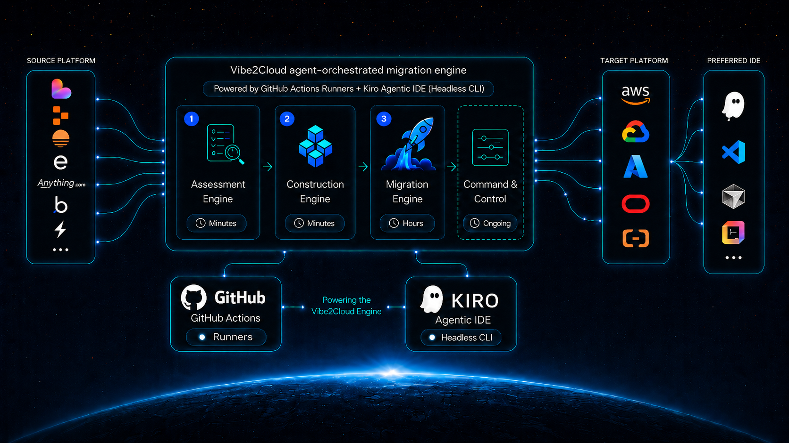
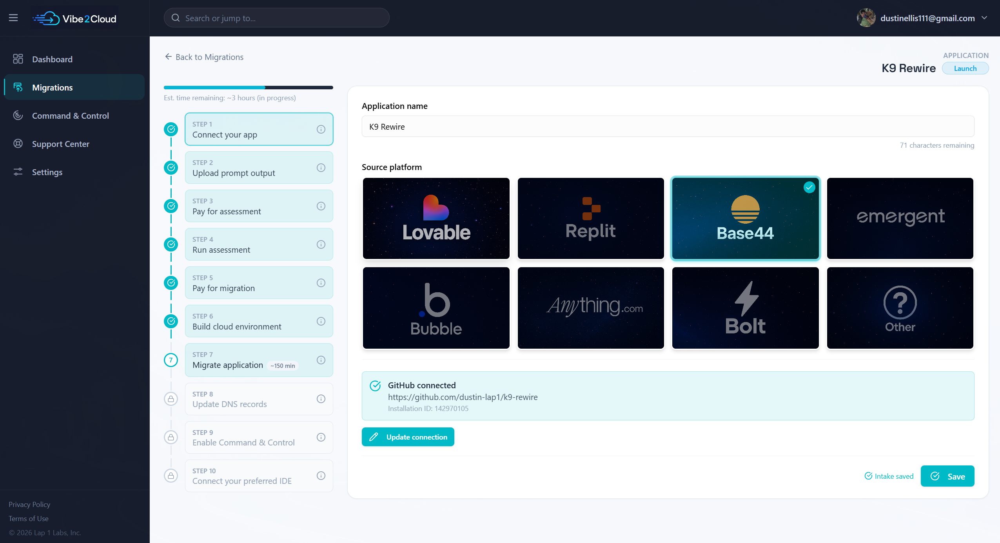
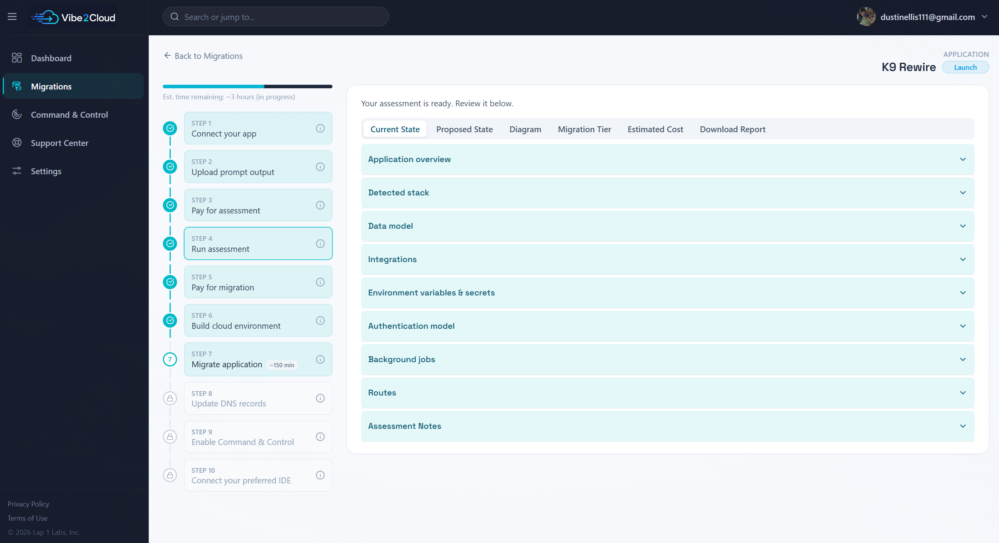
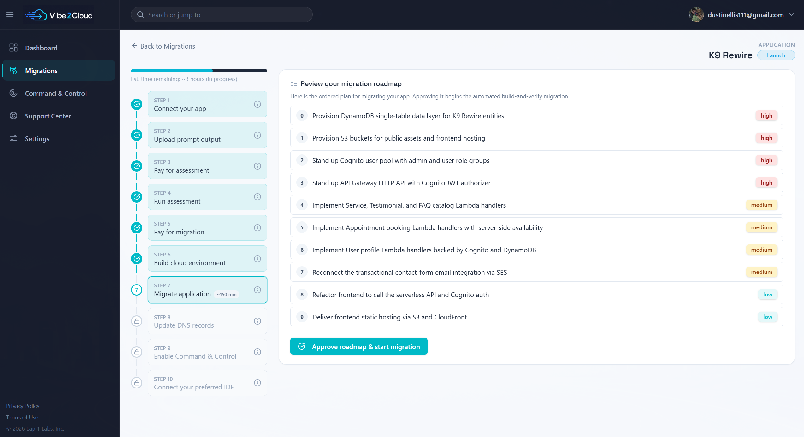

# Day 2: Build a Multiplayer Workspace for Agents and Humans

**Challenge:** build a multiplayer workspace where humans and AI agents team up to make something real, not another chatbot but a room where AI feels like part of the team, and you leave with a useful final output.

**This build:** *Vibe2Cloud.* Migrate your vibe-coded app to dedicated cloud infrastructure. Vibe2Cloud is your production launchpad: a shared workspace where an app owner (and their teammates) work alongside a crew of AI agents to move an app from any source vibe-coding platform to dedicated cloud infrastructure. The humans bring the app, the intent, and the approvals; the Kiro-powered migration agents do the assessment, the build-out, the migration, and the ongoing operations. You leave with a genuinely useful final output: your application, running in a secure, scalable, and production-grade cloud account with full ownership.

> **Status:** Vibe2Cloud (V2C) is a real product in active development, with a public beta opening in **late August 2026**. You can sign up for the beta at **https://www.vibe2cloud.com**. I started building V2C in May 2026 and continue to build it today. This Day 2 submission is a writeup of how it works and how Kiro powers it, not a copy of the full codebase which is more complex and private.



## Your MVP is working. Is it ready to scale?

Vibe-coding platforms are great for getting an MVP off the ground, but shipping that app to real customers exposes hard limits:

- **Infrastructure control:** your data, auth, functions, and database run on someone else's infrastructure with minimal control or SLA guarantees.
- **Rate limits and scalability:** these platforms aren't built for production load; one viral moment and the app goes down with no way to scale.
- **Complicated credit pricing:** credit-based pricing is hard to reason about, and a price change or deprecated feature puts your app at risk.
- **Custom integrations:** Stripe, SSO, custom APIs, and webhooks are costly, complex, or simply unsupported.
- **Vendor lock-in:** generated code is tightly coupled to platform SDKs, so untangling it later is expensive.
- **Minimal security controls:** often no firewall policies, threat detection, or encryption controls.

Proud of what you built, but not ready to tell a customer it runs on a vibe-coding platform? Vibe2Cloud has you covered. Skip the $20k agency and the weeks of waiting: trained migration agents move your app automatically, in hours, for a single fixed fee, with optional ongoing support and hosting. 

**What you get:** fully automated, agent-orchestrated migrations · live in under a day · no cloud expertise needed · fixed-price migration tiers · optional managed hosting and tech support.

## Why this is a "multiplayer workspace"

Vibe2Cloud isn't a button you press and walk away from. It's a shared workspace (powered by Cognito User Pools) where humans and AI agents can collaborate under one organization:

- **Create an account** and you get your organization's workspace.
- **Invite your teammates** into that workspace, so co-founders, engineers, and operators all share the same room and consolidated billing. 
- **Run multiple migrations from the same organization account.** Each app you bring gets its own migration, its own agent crew, and its own owned cloud environment, while everything stays organized under one workspace your team manages together.
- **Humans and agents stay in the same loop.** People name the app, answer intake, approve the roadmap, and connect the target cloud and GitHub; the agents do the heavy lifting and stream progress back into the workspace so the team always sees what's happening through every migration step. 

That is the multiplayer story: one account, one organization workspace, many human teammates, many AI agents, and as many migrations as your team needs.

## Self-service, agent-orchestrated (a bit like filing your taxes)

Vibe2Cloud is self-service. In its final state, using it will feel a bit like filing your taxes online: you fill out a few details, iterate through a short set of guided steps, and let the migration agents orchestrate everything under the hood, from your assessment and proposed architecture to your migration roadmap and beyond. You stay in control and approve each milestone, while the migration agents do the heavy lifting.

*(The screenshots below are draft UI.)*

**Step 1 · Connect your app**



A guided, self-service intake: securely link your repository and share a few details about your app. This is the only real manual setup, and it takes about a minute. From here the trained migration agents take over.

**Assessment output (proposed architecture, complexity, cost)**



The Assessment engine reads your app and returns a proposed architecture, a complexity score, and a monthly cost projection, all generated by agents under the hood, presented back in the workspace for you to review.

**Migration roadmap**



The agents lay out the step-by-step roadmap they will execute to rebuild and deploy your app on cloud infrastructure you own. You approve it, then the Migration engine works the plan spec by spec while you watch progress stream back into the workspace.

## The crew (the engines)

Trained AI agents move your app to your target cloud across three automated engines, plus an optional Command & Control teammate that stays on after launch:

| # | Engine | What the agent does | Typical time |
|---|--------|---------------------|--------------|
| 1 | **Assessment** | Reads the source app, maps stack, dependencies, and integrations, and produces a proposed architecture, a complexity score, and a monthly cost projection | Minutes |
| 2 | **Construction** | Provisions a dedicated, production-grade cloud environment you own, defined entirely in Terraform | Minutes |
| 3 | **Migration** | Rebuilds and deploys your app on the new stack spec by spec, verifies it, and cuts your domain over to the live environment | Hours |
| 4 | **Command & Control** *(optional)* | Keeps building on infrastructure you own with managed hosting and expert support, agents on standby | Ongoing |

**Source** (vibe-coding platforms like Bolt, Lovable, Replit, v0, Base44, and more) &rarr; **Vibe2Cloud engines** &rarr; **Target cloud** (AWS, Google Cloud, Azure, Oracle) &rarr; your **preferred IDE** (such as Cursor or Kiro).

## Kiro under the hood

The engines are not a pile of bespoke scripts. Each one is **Kiro running in headless mode (the Kiro CLI)** on a **GitHub Actions runner**:

```
  Human kicks off a stage in the workspace
                        │
                        ▼
        GitHub Actions runner starts a job
                        │
                        ▼
     Kiro Agentic IDE runs headless (Kiro CLI)
     steered by .kiro specs + steering files
                        │
        ┌───────────────┼───────────────┐
        ▼               ▼               ▼
   Assessment      Construction      Migration      then Command & Control (ongoing)
   (reads app)     (writes IaC/code) (deploys)
                        │
                        ▼
     Progress + artifacts stream back to the workspace
```

- **GitHub Actions Runners** provide the compute and isolation for every stage.
- **Kiro Agentic IDE (Headless CLI)** is the actual migration engine: it reads the app, reasons about the target cloud, writes the infrastructure and code, and executes the steps. It is the same agentic capability you use in the IDE, driven programmatically with minimal human intervention.
- **Kiro Specs + Steering** are how each engine knows *how* to behave: steering files encode the migration playbook and guardrails, and specs turn a given app's intent into concrete, ordered tasks the headless agent executes spec by spec for security and arhitectural consistency. 

Kiro is both how Vibe2Cloud is *built* and how it *runs*.

## Files

| Path | Purpose |
|------|---------|
| `README.md` | This writeup (challenge, build, how Kiro powers it, submission) |
| `v2c-kiro.png` | The Vibe2Cloud + Kiro architecture visual |
| `step1-connect-app.png` | Draft UI: guided, self-service intake (connect your app) |
| `step4-assessment-output.png` | Draft UI: assessment output (architecture, complexity, cost) |
| `step7-migration-roadmap.png` | Draft UI: the migration roadmap the agents execute |

---

## Submission details (copy/paste)

**Challenge day:** Day 2: Build a multiplayer workspace

**Project name:**
```
Vibe2Cloud (V2C)
```

**Public GitHub repo link:**
```
https://github.com/dustin-lap1/kiro-birthday-challenges
```

**Demo video link:**
```
https://www.loom.com/share/b23d68badeb44e05b12d80a29c3ac812
```

**Short description (2-3 sentences):**
```
Vibe2Cloud is your production launchpad: a multiplayer workspace where a team and a crew of AI agents migrate a vibe-coded app off a prototyping platform to dedicated cloud infrastructure you own, fully automated and live in under a day. You create an account, invite teammates into your organization workspace, and run multiple migrations from the same account, while three Kiro-powered engines (Assessment, Construction, Migration) plus optional Command & Control do the heavy lifting as headless Kiro CLI jobs on GitHub Actions runners. Vibe2Cloud is in active development with a public beta opening in late August 2026 at https://www.vibe2cloud.com.
```

**How Kiro was used (150-300 words):**
```
Kiro is both how Vibe2Cloud is built and how it runs. The migration engine itself is Kiro running headless (the Kiro CLI) on GitHub Actions runners. When someone kicks off a migration from the shared workspace, a runner starts a job that launches Kiro in headless mode, steered by .kiro specs and steering files, and the agent does the real work: the Assessment engine reads the source app and proposes an architecture and cost projection, the Construction engine provisions a dedicated cloud environment defined in Terraform, and the Migration engine rebuilds and deploys the app on the new stack spec by spec. Command & Control then keeps the live app running. The same agentic capability I use interactively in the Kiro IDE is driven programmatically in CI, so each engine is a real AI teammate rather than a brittle script.

Steering files encode the migration playbook and guardrails so every headless run behaves consistently, and specs turn a given app's intent into an ordered task list the agent executes. Progress streams back into the workspace, where a whole organization can collaborate: create an account, invite teammates, and run multiple migrations from one account for consolidated billing. 

I also built Vibe2Cloud itself with Kiro, and the entire tech stack is 100% hosted on AWS. I use spec-driven development (requirements, design, then tasks) plus steering files that teach Kiro our stack and conventions, and hooks that automate repetitive checks. That spec-first workflow is exactly how the client workspace and the migration walkthrough came together: humans set direction, Kiro does the heavy lifting, and we ship real, working software.
```

**Social post (X or LinkedIn):**
```
Day 2 of Kiro Birthday Week: Vibe2Cloud, your production launchpad. Create an account, invite your team, and migrate your vibe-coded apps to cloud infrastructure you own, together. The migration engine is Kiro running headless (Kiro CLI) on GitHub Actions runners: assess, construct, migrate, operate.

Beta opens late August 2026: https://www.vibe2cloud.com
Repo: https://github.com/dustin-lap1/kiro-birthday-challenges

#BuildWithKiro #TeamKiro @kirodotdev
```

