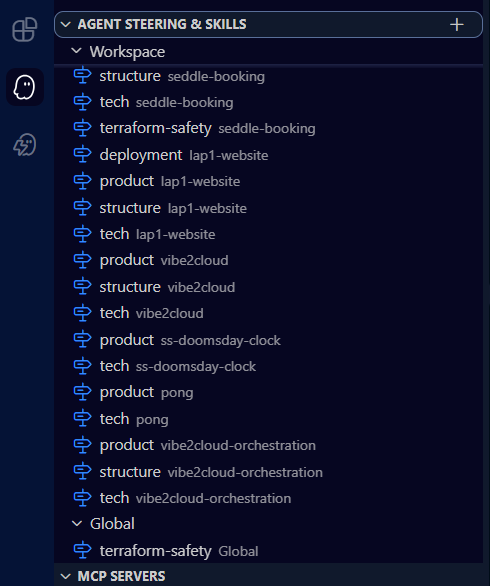

# Day 3: Build a Functional Fix for a Broken Project

**Challenge:** don't build something new, fix something broken. Point Kiro at a project with broken behavior, use **Autopilot** to investigate and repair it, and show it going from red to green. The bar is meaningful investigation and a fix that preserves existing behavior, not a trivial typo change.

**This build:** *Steering Tune-Up.* The "broken project" here isn't a failing unit test, it's my entire **Kiro configuration** across a multi-root workspace. My steering had quietly rotted into a state that was actively degrading every agent session: 20+ steering documents, almost all set to load on every session, several out of date, and many bleeding across unrelated projects. Kiro audited the whole thing in Autopilot, diagnosed the misconfiguration, and repaired it, taking my sessions from "red" (bloated, inaccurate, wasteful context) to "green" (focused, accurate, cost-efficient), without changing how any individual project builds or deploys.



## Background: one IDE window, eleven projects

I run a [multi-root workspace](https://kiro.dev/docs/editor/multi-root-workspaces/) in Kiro, which lets me work across multiple projects and applications from the same IDE window. For a developer like me, that is a real productivity unlock: I jump between Repo A, Repo B, Repo C, and the rest without ever leaving the window.

My workspace has **exactly 11 projects**. Most are small "tinker" projects, but a few are business-critical, customer-facing applications. Naturally, each one has a slightly different tech stack, structure, and product description, along with other context unique to that project. At the same time, a few things need to be **globally consistent** across all of them, like my deployment procedure for Lambda functions and my Terraform safety guidelines.

## The Kiro features involved

- **[Agent Steering](https://kiro.dev/docs/steering/):** for each project I can set up steering documents that are injected into every agent session, so each iterative session already has the critical background it needs to keep building without me repeating myself.
- **The [inclusion flag](https://kiro.dev/docs/steering/):** the inclusion flag determines *when and how* a steering file (stored in `.kiro/steering/`) is loaded. You set it in the YAML front-matter at the top of the markdown file. Some docs can be **always** included, others **conditionally** (by file match) or **manually** (opt-in). Used well, it keeps sessions focused and cost efficient.

## What was broken (red)

I knew the inclusion flag existed, but I wasn't using it properly. The result:

- **20+ steering documents**, the large majority set to `inclusion: always`.
- Because it's a multi-root workspace, those always-on docs from every project were injected into **every** session, so working in Repo A dragged in Repo B's and Repo C's steering too.
- Several docs were **stale**, describing architecture that had since changed.
- Net effect: a big, ongoing hit to **context window consumption**, higher cost, and less focused agent responses. The configuration technically "ran," but it was behaving badly, which is exactly the kind of broken this challenge is about.

## How Kiro diagnosed and fixed it (green)

I fired up a Kiro chat, flipped it into **Autopilot**, and asked it to:

1. **Audit** every steering document across all 11 projects and report how each was being included and whether its content was still accurate.
2. **Update** each doc with the latest architectural details.
3. **Restructure** them cleanly per project into a consistent set: a `tech`, a `product`, and a `structure` document each.
4. **Assign proper inclusion flags** so a project's docs only load for that project, eliminating the cross-project bleed and the always-on bloat.
5. **Make the shared guardrails global / always included**, specifically my **Terraform safety guidelines** (I use Terraform for all of my projects) and my **Lambda deployment procedures**, so they're consistent everywhere.

Within about **20 minutes**, everything was updated. After testing with a few real sessions and deployments, everything worked great: the shared guardrails show up everywhere they should, project docs only load where they're relevant, and my context window is no longer flooded with irrelevant or inaccurate steering. My Kiro configuration is now more optimized and more accurate, with the same build and deploy behavior for each project preserved.

## Before / after

| | Before (red) | After (green) |
|---|---|---|
| Doc count | 20+, sprawling | Clean set per project (tech, product, structure) + shared globals |
| Inclusion flags | Mostly `always` | Correct per doc: always for globals, conditional/manual for project docs |
| Cross-project bleed | Every project's docs in every session | Project docs load only for their project |
| Accuracy | Several stale docs | Updated to current architecture |
| Context window | Bloated, costly | Focused and cost-efficient |
| Shared guardrails | Inconsistent | Terraform safety + Lambda deploy always included, globally |

## Files

| Path | Purpose |
|------|---------|
| `README.md` | This writeup (challenge, what was broken, how Kiro fixed it, submission) |
| `day3-steering-docs.png` | Kiro auditing and restructuring steering docs with inclusion flags |

---

## Submission details (copy/paste)

**Challenge day:** Day 3: Build a functional fix for a broken project

**Project name:**
```
Steering Tune-Up (Multi-Root Kiro Config Fix)
```

**Public GitHub repo link:**
```
https://github.com/dustin-lap1/kiro-birthday-challenges
```

**Demo video link:**
```
<add your before/after demo video link here>
```

**Short description (2-3 sentences):**
```
Steering Tune-Up is a fix for a broken project, where the "project" is my own Kiro configuration across an 11-project multi-root workspace. My steering had rotted into 20+ documents that were almost all set to load on every session, several out of date, and bleeding across unrelated projects, quietly bloating my context window and degrading responses. In Autopilot, Kiro audited every steering doc, updated them with current architecture, restructured them cleanly per project (tech, product, structure), and assigned proper inclusion flags, making Terraform safety and Lambda deployment procedures global while scoping project docs so only the applicable ones load, taking my sessions from bloated and inaccurate (red) to focused and cost-efficient (green).
```

**How Kiro was used (150-300 words):**
```
The broken "project" was my Kiro setup itself. I run a multi-root workspace with exactly 11 projects in one IDE window. Kiro's Agent Steering injects per-project background into every session, and the inclusion flag in each steering file's front-matter controls when a doc loads (always, conditionally, or manually). I knew the flag existed, but I wasn't using it well: I had 20+ steering documents, the majority set to always-included. In a multi-root workspace that meant every project's steering was injected into every session, so working in one repo dragged in the steering of ten others. Several docs were also stale. The result was a real, ongoing hit to context window consumption and less focused responses.

I opened a Kiro chat, switched to Autopilot, and asked Kiro to audit all of my steering documents, update them with the latest architectural details, and restructure them cleanly per project with a tech, product, and structure doc each. The investigation was the meaningful part: Kiro read through every doc across all 11 projects, identified which were stale, which were always-on unnecessarily, and which were cross-pollinating into unrelated sessions. It then assigned proper inclusion flags so project docs only load for their project, and made my shared guardrails (Terraform safety guidelines and Lambda deployment procedures) global and always included, since those must stay consistent everywhere.

Within about 20 minutes everything was updated. I verified the fix by running several real agent sessions and deployments: the globals appear everywhere, project docs load only where relevant, and my context is no longer flooded. Same build and deploy behavior per project, just a far cleaner, cheaper, more accurate configuration.
```

**Social post (X or LinkedIn):**
```
Day 3 of Kiro Birthday Week: I fixed a broken project, and the broken project was my own Kiro config. Across an 11-project multi-root workspace I had 20+ steering docs, almost all always-on, bloating every session. In Autopilot, Kiro audited them all, refreshed them, restructured tech/product/structure per project, and set proper inclusion flags, with Terraform safety and Lambda deploy made global. Red to green in ~20 minutes.

Repo: https://github.com/dustin-lap1/kiro-birthday-challenges

#BuildWithKiro #TeamKiro @kirodotdev
```

---

## Demo video script (~30-60 seconds, before/after)

Read the lines aloud; the cues in brackets are what to show on screen.

> **[0:00 — Kiro open, the .kiro/steering folders across the multi-root workspace visible]**
> "For Day 3, I didn't build something new, I fixed something broken: my own Kiro configuration. I run one IDE window with 11 projects."
>
> **[0:08 — BEFORE: show the pile of steering docs, front-matter set to inclusion: always]**
> "Here's the broken state. Over 20 steering documents, and almost all of them set to load on every session. In a multi-root workspace that means every project's steering gets injected into every session, so my context window was bloated, costly, and some docs were out of date."
>
> **[0:22 — Show the Autopilot chat where I asked Kiro to audit and fix it]**
> "I flipped Kiro into Autopilot and asked it to audit all my steering, update it, restructure it per project into tech, product, and structure docs, and assign proper inclusion flags."
>
> **[0:34 — AFTER: show a project's clean tech/product/structure docs with scoped inclusion flags, and the global Terraform + Lambda docs]**
> "About 20 minutes later: clean docs per project with the right inclusion flags, so a project's steering only loads for that project. And my shared guardrails, Terraform safety and Lambda deployment, are now global and always included."
>
> **[0:48 — Show a fresh session in one repo pulling in only the right docs, plus a successful deploy]**
> "Red to green. I tested it with real sessions and a couple of deployments: focused context, accurate docs, same build and deploy behavior, just far more efficient. That's Day 3."
