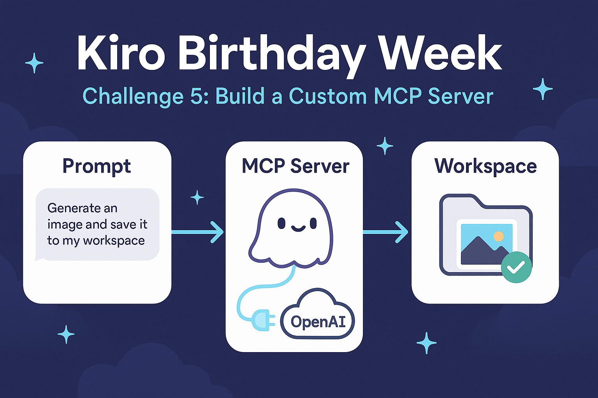

# Day 5: Build a Custom MCP Server

**Challenge:** extend Kiro itself by building a **custom Model Context Protocol (MCP) server** that connects Kiro to an external system and unlocks something Kiro can't do on its own. The server has to be real (registered and callable from inside Kiro), connect to an outside service, and ship as a self-contained, documented folder.

**This build:** *Image Gen MCP.* A local, stdio-based MCP server (Node.js, ESM) that bridges Kiro to the **OpenAI Images API** so Kiro can generate images from within a conversation and write the resulting PNG **directly into your workspace**. No more copy/paste loop — today you ask Kiro to draft a prompt, paste it into ChatGPT, iterate, then manually save the image back into the repo. With this server, Kiro composes the prompt from its own conversation, project, and steering context, calls the `generate_image` tool, and the image lands in `public/images/` — so Kiro is immediately aware of the file.



> The banner above was generated **by this very server** — I registered it in Kiro, asked for a Day 5 challenge image, and Kiro produced the PNG straight into `public/images/`.

## How it works

```
  Prompt (from Kiro)        MCP server (this repo)          Workspace
  ──────────────────  ──▶   ──────────────────────   ──▶   ─────────────────
  "generate an image        generate_image tool             public/images/
   and save it"             → OpenAI Images API             day-05-challenge.png
                            → decode + atomic write         (Kiro sees it instantly)
```

1. **Kiro composes a prompt** from the conversation and calls `generate_image` over stdio.
2. **The server calls the OpenAI Images API** (`gpt-image-1`, falling back to `dall-e-3`), decodes the returned base64, and **atomically writes** the PNG into the workspace.
3. **Kiro immediately sees the file** — no ChatGPT round trip, no manual save.

## External service

This server connects to the **OpenAI Images API**
(`POST /v1/images/generations` and `/v1/images/edits`). It supports the
`gpt-image-1` and `dall-e-3` image models, defaulting to `gpt-image-1` and
automatically falling back to `dall-e-3` if your account lacks access.

> ⚠️ **Cost notice:** invoking `generate_image` (or `edit_image`) performs a
> **paid OpenAI Images API call**. Each successful generation bills your OpenAI
> account.

## Tools

| Tool | Status | Purpose |
|---|---|---|
| `generate_image` | always on | Generate a new image from a text prompt and save it as a PNG in the workspace. |
| `edit_image` | optional (`ENABLE_EDIT_TOOL`) | Edit / create a variation of an existing local image. |
| `list_generated_images` | optional (`ENABLE_LIST_TOOL`) | List the image files already in the output directory. |

The optional tools are only registered (and advertised to Kiro) when their
enable flag is set.

## Setup

1. **Install dependencies** (from inside this folder):

   ```bash
   npm install
   ```

2. **Set your OpenAI API key.** Copy the example env file and fill in your key:

   ```bash
   cp .env.example .env
   # then edit .env and set OPENAI_API_KEY=sk-...
   ```

   The key is read from the `OPENAI_API_KEY` environment variable. It is never
   committed (`.env` is git-ignored) and never written to logs.

3. **Register the server in Kiro.** Add the entry from
   [`.kiro/settings/mcp.json`](.kiro/settings/mcp.json) to your workspace (or
   user-level) MCP config, and set `OPENAI_API_KEY` in its `env` block. Kiro
   launches the server as a Node.js ESM process over stdio.

   > **Tip:** the user-level config (`~/.kiro/settings/mcp.json`) lives in your
   > home directory, outside any repo, so your real key there is never committed.
   > The example config committed in this folder keeps a non-secret placeholder.

## Environment variables

| Variable | Required | Default | Description |
|---|---|---|---|
| `OPENAI_API_KEY` | **yes** | — | Your OpenAI API key. Read at tool-call time; absent/empty/whitespace-only values cause a clear error and no API call. |
| `STYLE_GUIDE_PATH` | no | _(none)_ | Path to a local style/brand file whose contents are prepended to every prompt so generated art stays on-brand. |
| `ENABLE_EDIT_TOOL` | no | `false` | Set to `true`/`1`/`yes`/`on` to register the `edit_image` tool. |
| `ENABLE_LIST_TOOL` | no | `false` | Set to `true`/`1`/`yes`/`on` to register the `list_generated_images` tool. |
| `WORKSPACE_ROOT` | no | launch cwd | Absolute workspace root. All writes are confined to this directory; a bad or malicious path cannot write files elsewhere. |

## Worked example: `generate_image`

Ask Kiro something like _"Generate a hero image of a friendly robot mascot
waving, flat vector style, and save it to the workspace."_ Kiro calls the tool
with arguments like:

```json
{
  "prompt": "A friendly robot mascot waving hello, flat vector illustration, soft pastel palette, centered on a white background",
  "size": "1024x1024",
  "quality": "high",
  "model": "gpt-image-1",
  "filename": "robot-mascot.png"
}
```

Only `prompt` is required. `size`, `quality`, `model`, `outputDir`, and
`filename` are all optional — omitting them uses the defaults
(`size: 1024x1024`, `quality: auto`, `model: gpt-image-1`,
`outputDir: public/images/`, and an auto-generated unique filename).

The server performs a paid OpenAI call, decodes the returned image, and writes
it into the workspace. The result confirms what happened:

```
Saved image to public/images/robot-mascot.png using model gpt-image-1
(size 1024x1024). A paid OpenAI Images API call was performed.
```

```json
{
  "savedFilePath": "public/images/robot-mascot.png",
  "model": "gpt-image-1",
  "size": "1024x1024",
  "warnings": []
}
```

The PNG is now on disk under `public/images/`, so Kiro can see and reference it
immediately. If a file with that name already exists, the server derives a
non-colliding name rather than overwriting it.

## Safety notes

- **Workspace-confined writes** — output directories and filenames are resolved
  to canonical absolute paths (symlinks and `..` resolved); anything outside the
  workspace root is rejected. Filenames containing path separators or `..` are
  rejected.
- **No secrets committed** — the API key comes from the environment; `.env` is
  git-ignored and only `.env.example` (a non-secret placeholder) is committed.
- **Resilient** — every error path returns a structured error result and the
  server keeps running to serve the next call.

## Running the tests

```bash
npm test
```

Runs the unit and property-based tests (Node's built-in test runner +
`fast-check`) — **59 tests**, including a property test for each of the 17
formal correctness properties in the design. No real network or disk access is
required; all effects (`fetch`, `fs`, `realpath`, clock) are injected.

## Files

| Path | Purpose |
|------|---------|
| `README.md` | This writeup (challenge, how it works, setup, submission) |
| `src/` | MCP server source — pure core modules + `tools/` handlers |
| `src/index.mjs` | Protocol/entry layer: stdio server, tool registry, startup watchdog, API-key redaction |
| `.kiro/settings/mcp.json` | Example MCP registration (non-secret placeholder key) |
| `.env.example` | Environment variable template |
| `public/images/day-05-challenge.png` | The Day 5 banner — generated by this server |

> The Kiro-generated spec for this build (`requirements.md`, `design.md`,
> `tasks.md`) lives at the repo root under
> [`.kiro/specs/day-05-image-gen-mcp/`](../.kiro/specs/day-05-image-gen-mcp/).

---

## Submission details (copy/paste)

**Challenge day:** Day 5: Build a custom MCP server that connects Kiro to an external system

**Project name:**
```
Image Gen MCP
```

**Public GitHub repo link:**
```
https://github.com/dustin-lap1/kiro-birthday-challenges/tree/main/day-05-image-gen-mcp
```

**Demo video link:**
```
https://www.loom.com/share/6c67853a97454081a78195718ea324c2
```

**Short description (2-3 sentences):**
```
Image Gen MCP is a local, stdio-based Model Context Protocol server that connects Kiro to the OpenAI Images API, so Kiro can generate an image from a conversation and save the PNG straight into the workspace - no ChatGPT copy/paste loop. It exposes a generate_image tool (plus optional edit_image and list_generated_images), confines every write to the workspace, keeps the API key out of logs and version control, and falls back from gpt-image-1 to dall-e-3 automatically. It was built with Kiro's spec workflow and is validated by 59 tests, including a fast-check property test for each of 17 formal correctness properties.
```

**How Kiro was used (150-300 words):**
```
This build extends Kiro itself. Day 5 asked for a custom MCP server that connects Kiro to an external system and unlocks something Kiro can't do alone, so I built a local, stdio-based Model Context Protocol server (Node.js, ESM) that bridges Kiro to the OpenAI Images API and writes generated PNGs straight into the workspace.

I built it with Kiro's spec-driven workflow. Kiro generated a full spec - requirements, a design with 17 formal correctness properties, and an ordered task list - under .kiro/specs/day-05-image-gen-mcp/, then executed the tasks wave by wave. Pure, injected-effect core modules came first (config, validation, path safety, prompt composition, filename derivation, listing, base64), then the effect boundaries (an OpenAI client with a gpt-image-1 to dall-e-3 fallback, and an atomic file writer), then the three tool handlers (generate_image plus optional edit_image and list_generated_images), and finally the protocol layer wiring stdio, a flag-gated tool registry, a startup watchdog, and API-key redaction. Every correctness property became a fast-check property test; the suite is 59 tests, all green, with no real network or disk.

Then I dogfooded it. I registered the server in my user-level mcp.json, verified it connected in Kiro's MCP panel, and asked Kiro to generate this challenge's banner image. Kiro composed the prompt from our conversation, called generate_image, and the PNG landed in public/images/ with no copy/paste. The banner on this page was produced by the very server the challenge is about.
```

**Social post (X or LinkedIn):**
```
Day 5 of Kiro Birthday Week: I taught Kiro a new trick by building a custom MCP server. It bridges Kiro to the OpenAI Images API, so Kiro can generate an image from our conversation and drop the PNG straight into my workspace - no ChatGPT copy/paste. Then I used it to make this post's image.

Built spec-first and validated with 59 tests (a property test per correctness property).

#BuildWithKiro #TeamKiro @kirodotdev
```

---

## Demo video script (~30-60 seconds)

Read the lines aloud; the cues in brackets are what to show on screen.

> **[0:00 — Kiro open, this README visible]**
> "For Day 5, the challenge is to build a custom MCP server that connects Kiro to an external system. I built one that bridges Kiro to the OpenAI Images API — so Kiro can generate images and save them straight into my workspace."
>
> **[0:12 — Show the MCP Servers panel with `image-gen` connected]**
> "It runs locally over stdio. Here it is registered and connected in Kiro, advertising the generate_image tool. My API key lives in my user-level config, never in the repo."
>
> **[0:24 — Show .kiro/specs/day-05-image-gen-mcp with requirements, design, tasks]**
> "Kiro built it spec-first: requirements, a design with seventeen correctness properties, and a task list — then wrote the whole server and a fast-check property test for each property. Fifty-nine tests, all green."
>
> **[0:40 — In chat, ask Kiro to generate the Day 5 banner; show the file appear in public/images/]**
> "Now the fun part: I ask Kiro for a Day 5 image. It composes the prompt, calls the tool, hits OpenAI, and the PNG lands right here in public/images — no copy/paste from ChatGPT."
>
> **[0:52 — Open the generated banner]**
> "And there it is — the image on my README, generated by the very server this challenge is about. That's Day 5."
